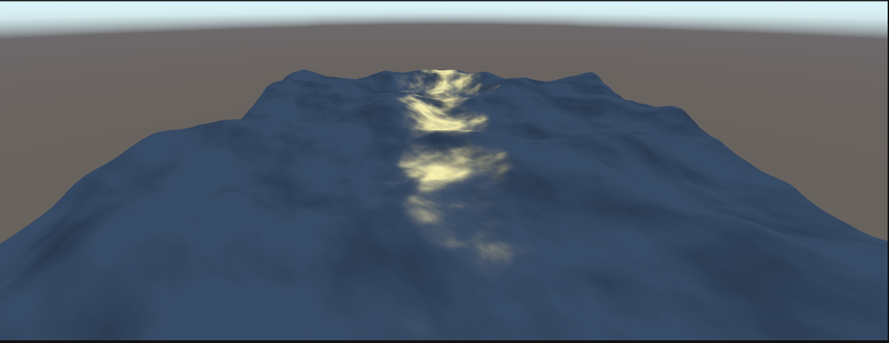

## Terrain Generation with Unity 
I use this project to be more fluent with Unity and to create interesting terrains using shaders (Built-In Pipeline)

### 1. Water Terrain 
Using various mathematic techniques to generate the feeling of water surface
#### Function for waves 
- $e^{sin(x \cdot w + t \cdot \phi)-1}$
- this function gives a more natural feeling of waves because of the sharper edges
- Unlike the regular sum of Sines (which have bulkier edges)
- With each octave, the wave is rotated to give a more natural feeling

#### Lighting Techniques 
- With help of calculus we can calculate more precisely the normals, rather than with a neighbor approximation 
    - This is possible because we have a concrete formula to generate the waves
        - Another used method is taking the neighbors of a point into consideration 
        - However this stronlgy depends on the distance to the neighbors (that is why it can only be an approximation)
    - We can calculate the Tangent and Binormal from the partial derivatives of the wave function
    - $\frac{d}{dx} = a \cdot w \cdot  e^{sin(x \cdot w + t \cdot \phi)-1} \cdot cos(x \cdot w + t \cdot \phi)$
    - Tangent $T = (1, \frac{d}{dx}, 0)$
    - Binormal $B= (0, \frac{d}{dz}, 1)$
    - Normal $N = B \times T$ 
    - (taking into consideration the y-Component is the up direction in unity)
- Specular light is calculated with the dot product between the normal and the halfvector

## Demonstration
